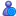

Source images
=============

Used to generate icons and publication assets.

Icons
-----

### Dolibarr

These resides in the [/img](../../img) directory.

#### Small

Required.
Name must begin by ```object_```.

- Sample:   [object_linkcomercial.png](../../img/object_linkcomercial.png)
- Size: 14×14 pixels
- Type: PNG

#### Large

Optional.

- Sample:  [linkcomercial.png](../../img/linkcomercial.png)
- Size: 32×32 pixels
- Type: PNG

### Dolistore

Designed to fit a 512×512 icon + publisher branding.

- Size: 704×704
- Type: PNG

Export to 512×512

### Transifex

- Size: 96×96
- Type: PNG

### Others

To be on the safe side, you may also want to generate all popular sizes:
- 16×16
- 32×32
- 48×48
- 64×64
- 128×128
- 256×256
- 512×512
